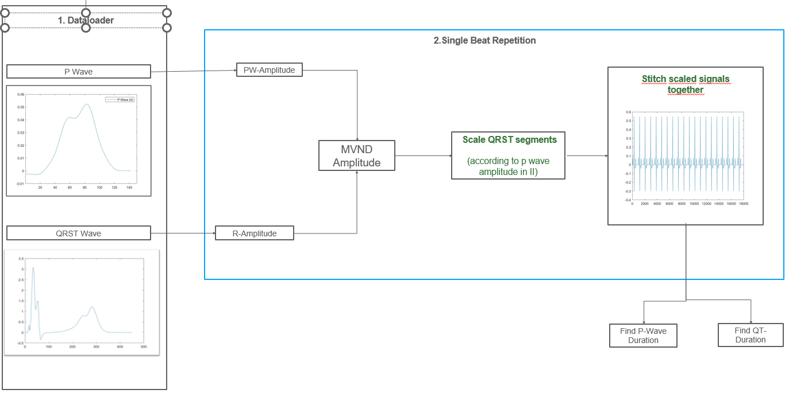
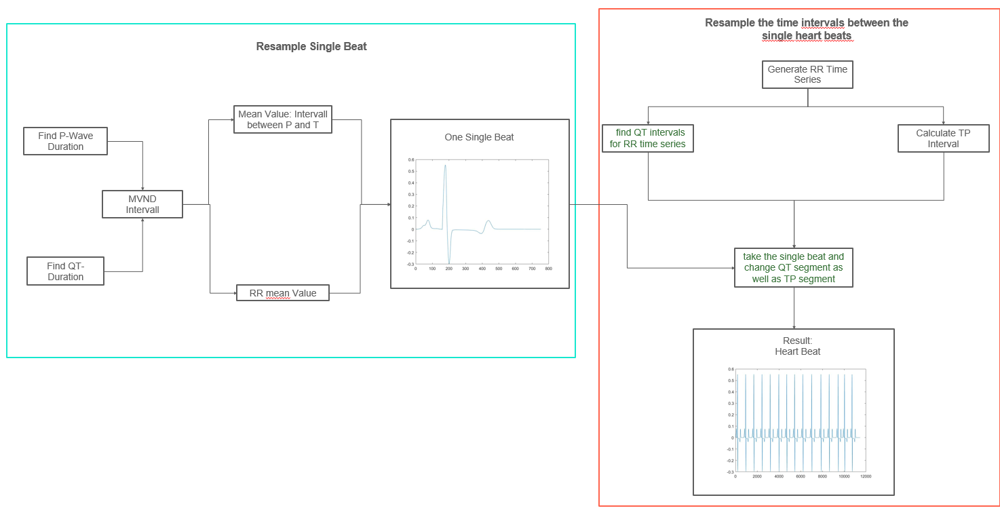

# cn617_ecgSynthesization

**Synthesization of P waves and QRST segments of simulated data**
 

The code combines separately simulated P waves and QRST segments to an ECG segments of 10 seconds (main function: synthesize_P_QRST_timeSeries). To achieve this, both the distance between the P wave and QRST complex and the distance between the individual heartbeats must vary for each beat. The figure below shows the different steps to create this ECG sample.

First, the amplitude of the QRST complex is scaled according to the P wave amplitude using multivariate normal distributions. P wave duration and the QT duration are extracted from the simulation results:

The next step is to generate one heartbeat. To get the values for the mean RR interval (duration of a heartbeat) and for the distance between the end of the P wave and the beginning of the QRST complex a multivariate distribution is used. The calculated P wave duration and QT interval are used to find intervals from the multivariate distribution which are close to the simulated query values. With the newly calculated value for the interval between the P and QRST wave, the two wave sequences are stitched together to one single heartbeat.

Subsequently, an ECG of 15 heartbeats should be generated. To attain realistic data, every single heartbeat must have a different duration. This is achieved through a generated time series, that contains 15 values for the consecutive RR intervals. According to the RR interval of a single beat, the QRST segment is stretched or shrunk, so that together with the calculated TP interval, the time series of the ECG can be put together. 

Optionally, realistic ECG noise as described by Petrenas et al., 2017, Physiol Meas, vol. 38, pp. 2058-2080 ([doi:10.1088/1361-6579/aa9153](https://dx.doi.org/10.1088/1361-6579/aa9153)) can be added to the synthetic ECG and filter settings can be applied.
